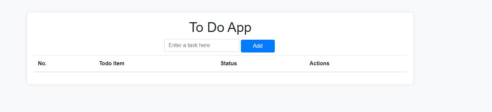
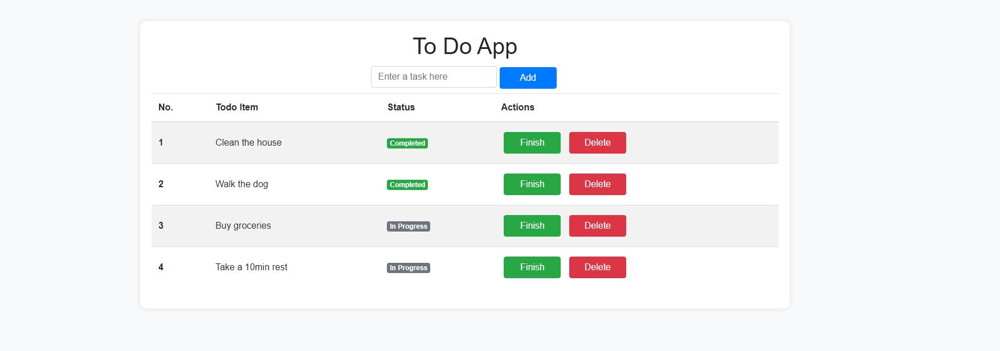

# Features
- Add Tasks: Users can add new tasks to their to-do list.
- Update Tasks: Users can mark tasks as complete or incomplete.
- Delete Tasks: Users can remove tasks from their to-do list.
- Persistent Storage: Tasks are stored in a SQLite database, ensuring data persistence between sessions.

# Technologies Used
- Flask
- SQLAlchemy
- SQLite 
- HTML/CSS
- Bootstrap

